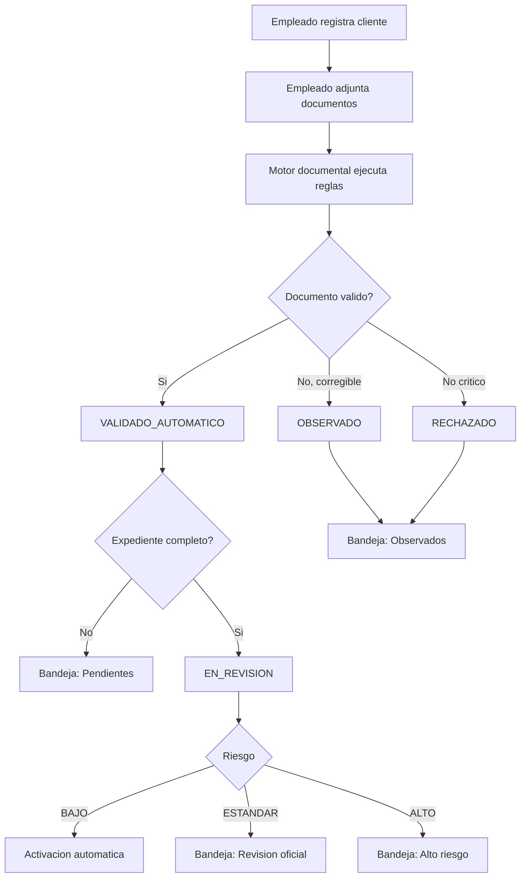

# Flujo de cumplimiento automatizado

## Resultado operativo

El sistema procesa casos simples y el Oficial atiende excepciones. La auditoria registra cada regla y cada decision para justificar el resultado.
