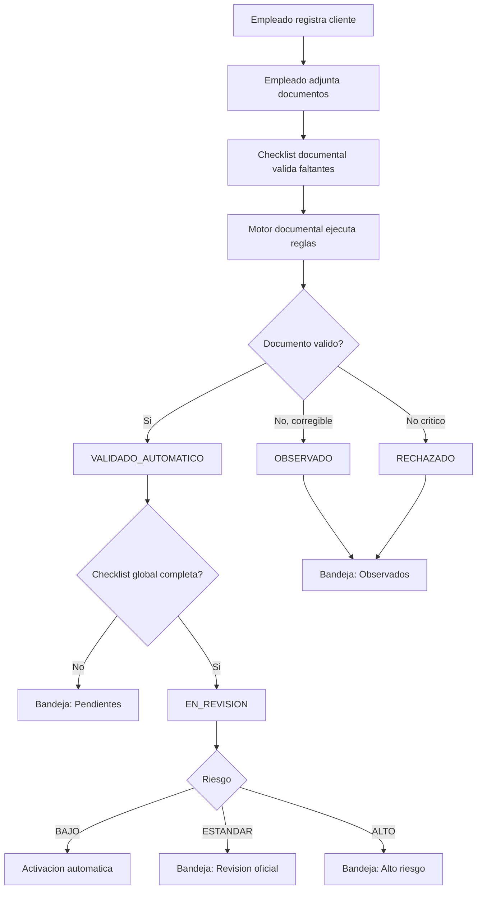

# Flujo de cumplimiento automatizado

## Resultado operativo

El sistema procesa casos simples y el Oficial atiende excepciones. La auditoria registra cada regla y cada decision para justificar el resultado.

## Checklist global del expediente

La checklist global es el contrato operativo que evita que cada pantalla interprete por separado si un expediente esta listo.

Incluye:

- datos del cliente
- perfiles financiero y transaccional
- documentos obligatorios
- beneficiarios finales relevantes
- observaciones abiertas
- riesgo vigente
- screening PEP/sanciones
- activacion

Cada item define:

- `status`: `COMPLETO`, `PENDIENTE`, `BLOQUEADO` o `NO_APLICA`
- `blocking`: si impide avance
- `owner`: responsable esperado
- `message`: explicacion corta
- `action_route`: pantalla a la que debe ir el usuario

La checklist se consulta desde:

- detalle del expediente
- Activacion
- Cumplimiento
- Beneficiarios finales
- Observaciones
- modales de decisiones sensibles

## Decisiones sensibles

Las decisiones sensibles no deben ser botones instantaneos. Actualmente usan modal contextual:

| Decision | Confirmacion | Contexto mostrado |
|----------|--------------|-------------------|
| Activar expediente | Modal; alto riesgo exige texto `APROBAR` | Checklist global, estado, riesgo y bloqueos |
| Rechazar expediente | Motivo obligatorio y texto `RECHAZAR` | Checklist global y datos del cliente |
| Aprobar/rechazar BF | Texto `APROBAR` o `RECHAZAR`; rechazo con motivo | Relevancia, PEP, participacion y checklist global |
| Cerrar observacion | Texto `CERRAR` | Respuesta registrada y checklist global |
| Aprobar/rechazar documento | Texto `APROBAR` o `RECHAZAR`; rechazo con motivo | Archivo, tipo, estado y efecto esperado |
| Reemplazar documento | Motivo obligatorio | Documento anterior y nuevo soporte |

La decision final sigue validandose en backend. La UI informa y reduce errores, pero no reemplaza reglas deterministicas.

## Observaciones

Una observacion abierta bloquea la activacion.

Flujo:

1. Oficial crea observacion.
2. Si el cliente estaba `PENDIENTE` o `EN_REVISION`, pasa a `OBSERVADO`.
3. Empleado responde mediante modal.
4. Oficial revisa respuesta.
5. Oficial cierra con confirmacion `CERRAR`.
6. El sistema reevalua si el expediente puede volver a revision o activar automaticamente.

El cierre muestra checklist global porque puede desbloquear el expediente.
